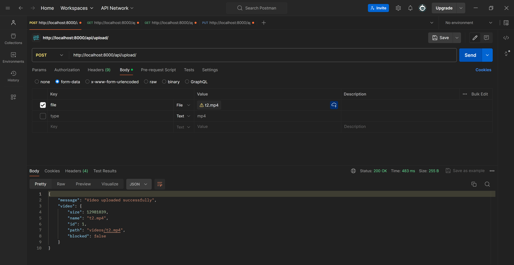
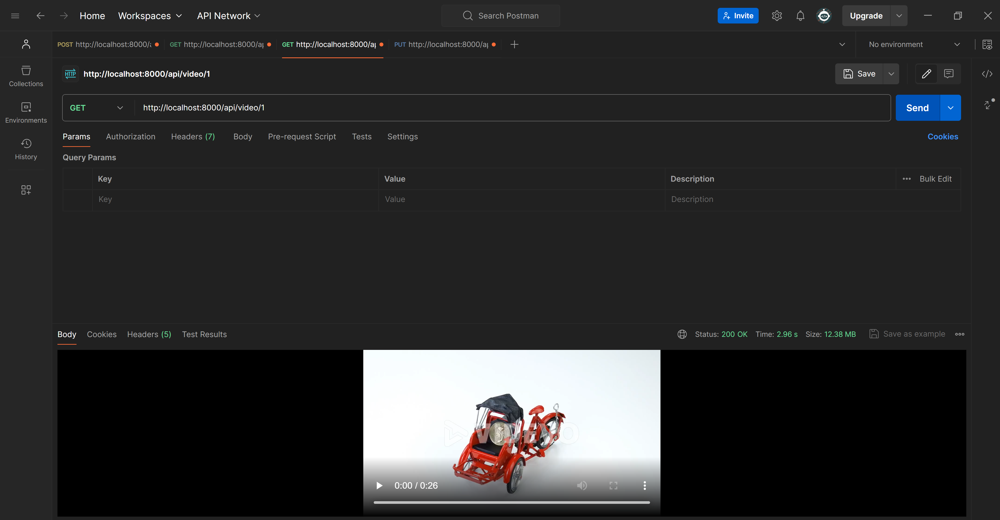
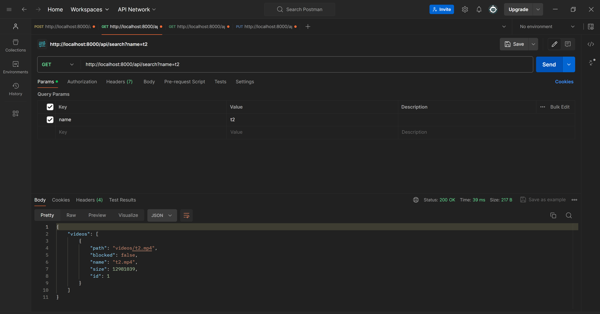
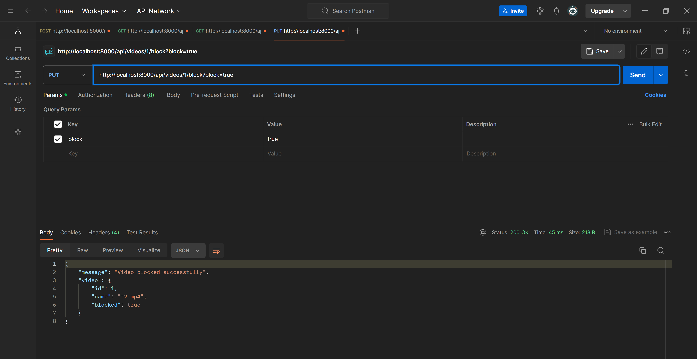

# Video Management API

This project provides a simple Video Management API to handle video uploads, downloads, and management functionalities such as searching and blocking/unblocking videos.

## Features
- Upload videos to the server.
- Download videos from the server.
- Search videos by name and size.
- Block or unblock videos.

## API Endpoints

### 1. Upload Video
- **Endpoint**: `/api/upload`
- **Method**: `POST`
- **Request**: 
  - Form-data:
    - `file`: The video file to be uploaded.
- **Response**:
  - `200 OK`: Returns the uploaded video details.
  - `400 Bad Request`: If the file type is unsupported or missing.

### 2. Download Video
- **Endpoint**: `/api/video/{video_id}`
- **Method**: `GET`
- **Response**:
  - `200 OK`: Returns the video file.
  - `404 Not Found`: If the video with the given ID does not exist.

### 3. Search Videos
- **Endpoint**: `/api/search`
- **Method**: `GET`
- **Query Parameters**:
  - `name`: (optional) The name of the video to search for.
  - `size`: (optional) The size of the video file to search for.
- **Response**:
  - `200 OK`: Returns a list of matching videos.
  - `204 No Content`: If no videos match the search criteria.

### 4. Block/Unblock Video
- **Endpoint**: `/api/videos/1/block`
- **Method**: `POST`
- **Query Parameters**:
  - `block`: `true` to block, `false` to unblock.
- **Response**:
  - `200 OK`: Successfully blocked/unblocked the video.
  - `404 Not Found`: If the video with the given ID does not exist.

## Installation
1. Clone the repository:
   ```bash
   git clone https://github.com/Dhvanil02/video_management_task.git
   cd video_management_task
   ```

2. Run docker-compose:
   ```bash
   docker-compose up --build
   ```

## Screenshots

1. Upload Video


2. Download Video


3. Search Videos


4. Block/Unblock Video
